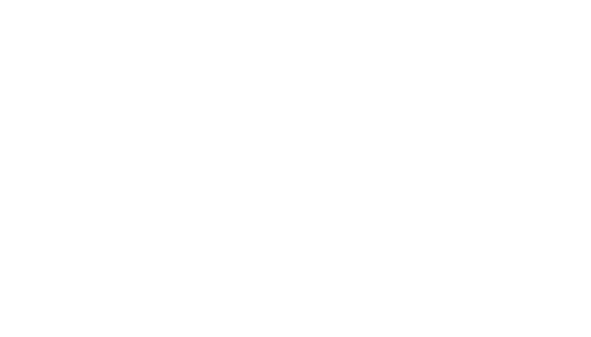

  

---

  <b>🌐 Pick another language / Choisissez une autre langue:</b>

  
   
  

---

  <b>🙋‍♂️ Sobre Mim</b>

  
    
  Olá, sou o Rui! Nasci em Portugal e me mudei para a Suíça aos 11 anos de idade. Atualmente, aos 21 anos, estou estudando no CPNV na Suíça, onde me formo como informático generalista, abrangendo tanto o desenvolvimento quanto a infraestrutura. Embora minha formação seja abrangente, tenho uma inclinação especial para seguir uma carreira em infraestrutura.
    
  Confira meu portfólio em <a href="http://ruimmp.site" target="_blank">ruimmp.site</a>!

  
  
  

---

  <b>🌍 Idiomas</b>

  Tenho proficiência nos seguintes idiomas:

  
  
  

---

  <b>🏆 Troféus do GitHub</b>

  

---

  <b>🎵 Música no Spotify</b>

<!--

  

-->

  

---

  <b>📊 Dados do GitHub</b>

  <!-- https://git.io/streak-stats -->
  
   
  <!-- https://github.com/anuraghazra/github-readme-stats?tab=readme-ov-file#wakatime-stats-card -->
  
   
  <!-- https://github.com/anuraghazra/github-readme-stats -->
  

  

